<h1>
作业五
</h1>
### 一、运行代码成功截图：

##### 1、k=3,iteration num=10

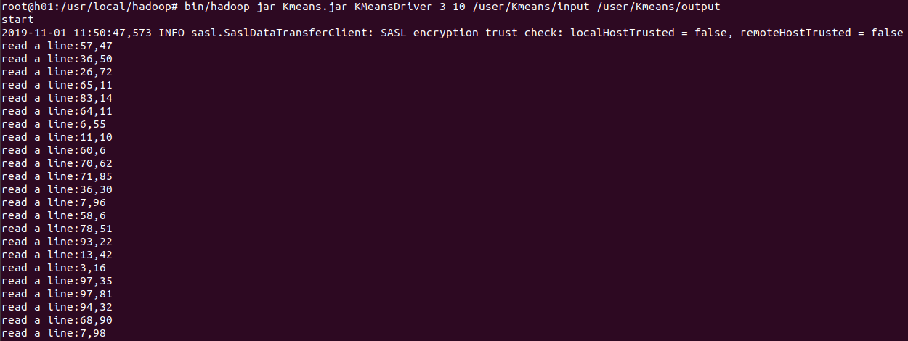

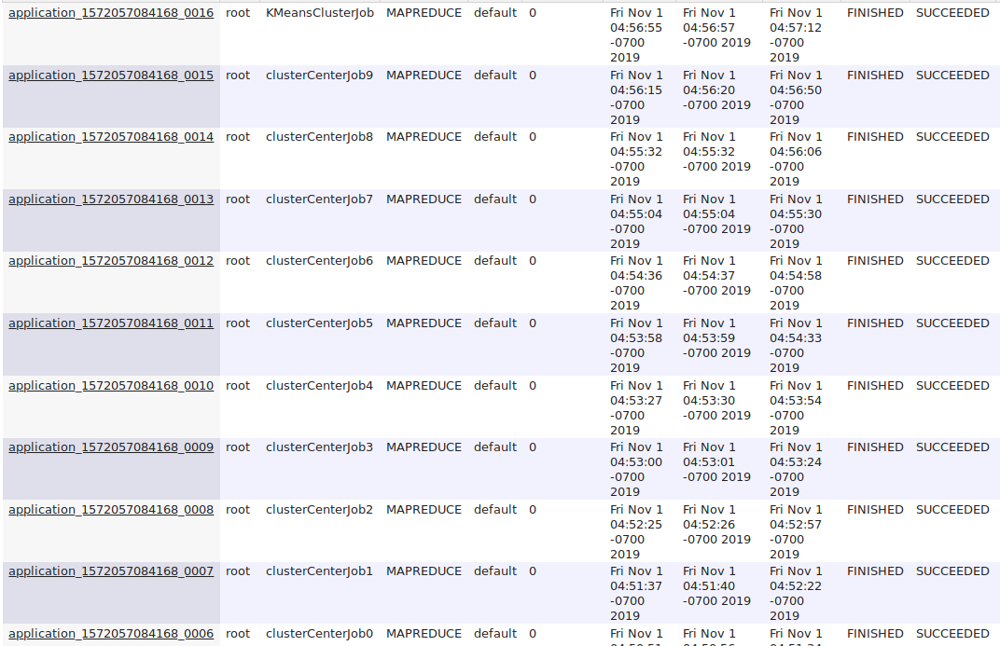

部分命令行输出数据：

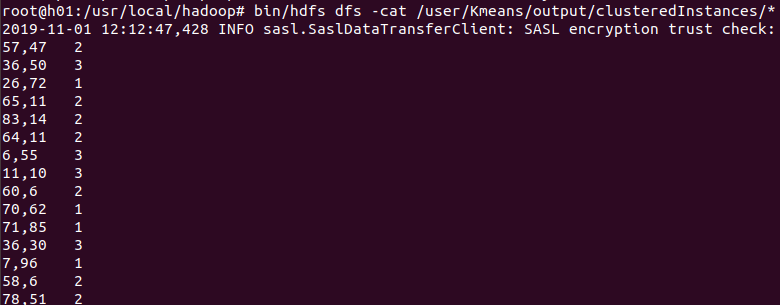

##### 2、k=4,iteration num=10

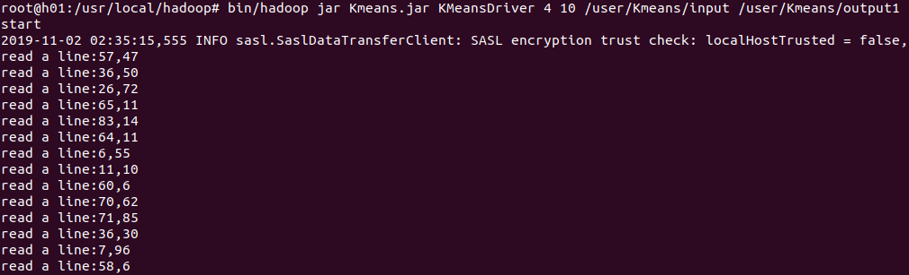

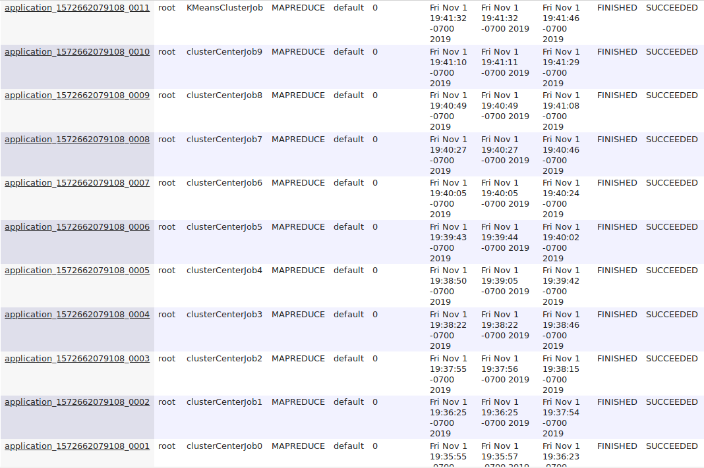

部分命令行输出数据：

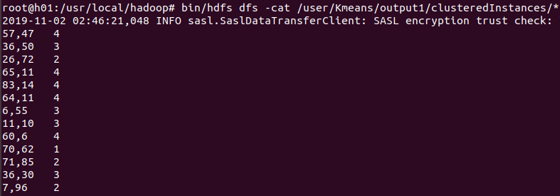

##### 3、k=5,iteration num=10

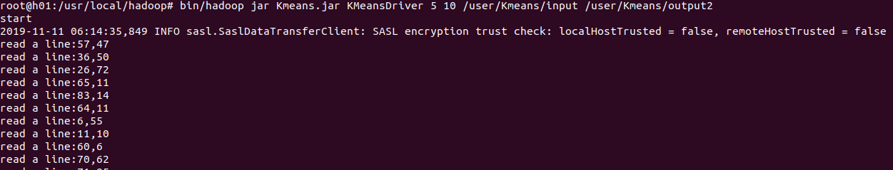

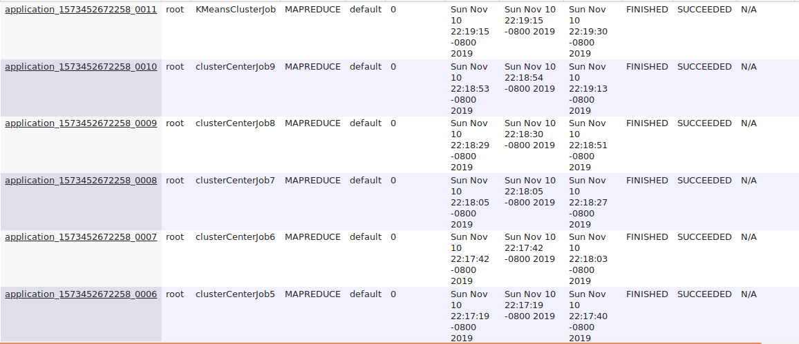

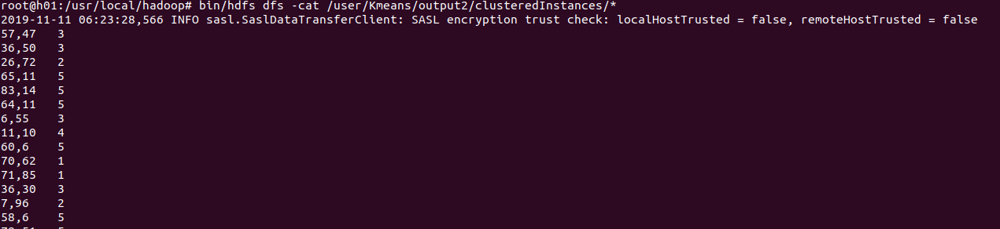

##### 4、k=5,iteration num=15

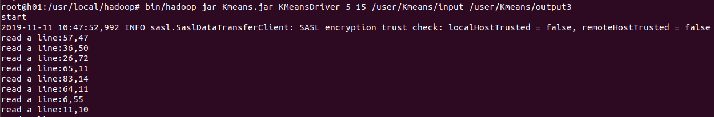

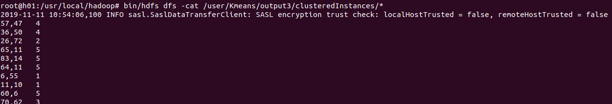

##### 5、k=10,iteration num=15

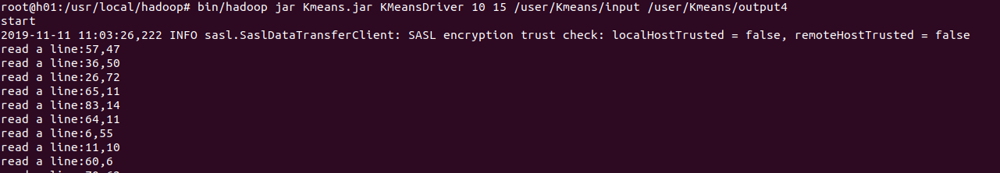

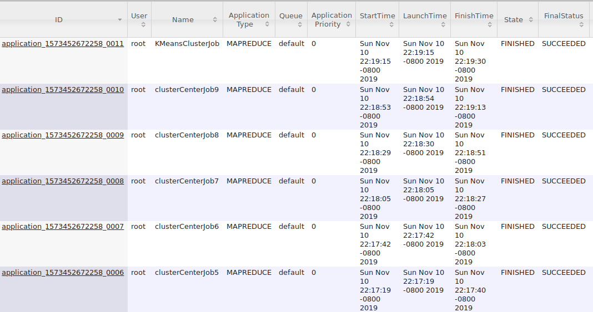

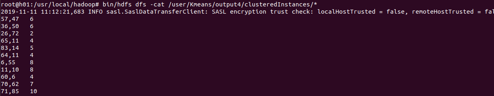

### 二、RStudio中画图结果：

##### 1、k=3,iteration num=10

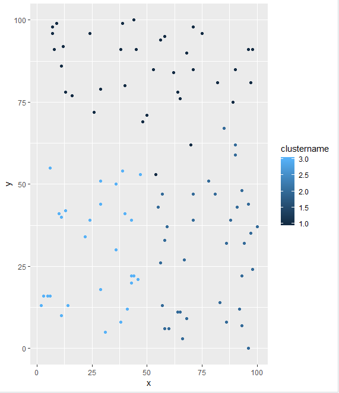

##### 2、k=4,iteration num=10

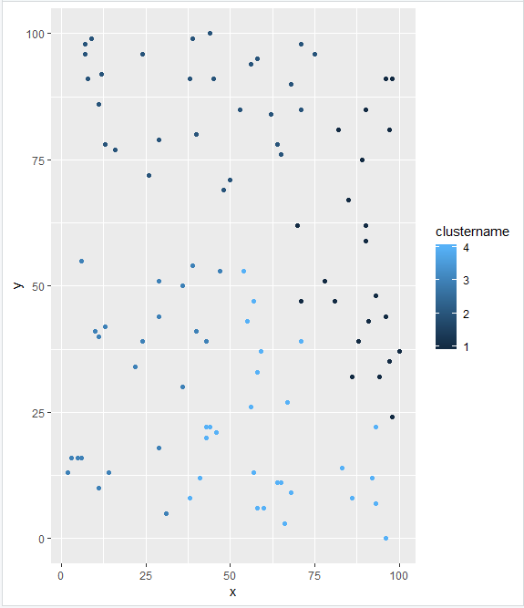

##### 3、k=5,iteration num=10

##### 4、k=5,iteration num=15

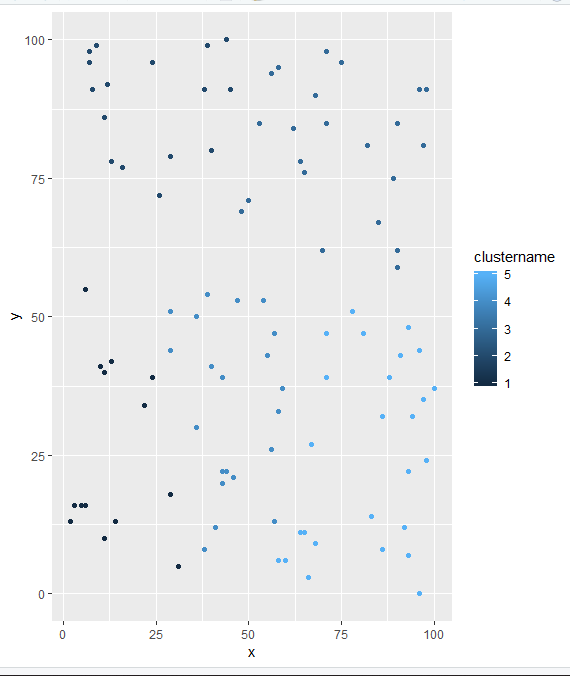

##### 5、k=10,iteration num=15

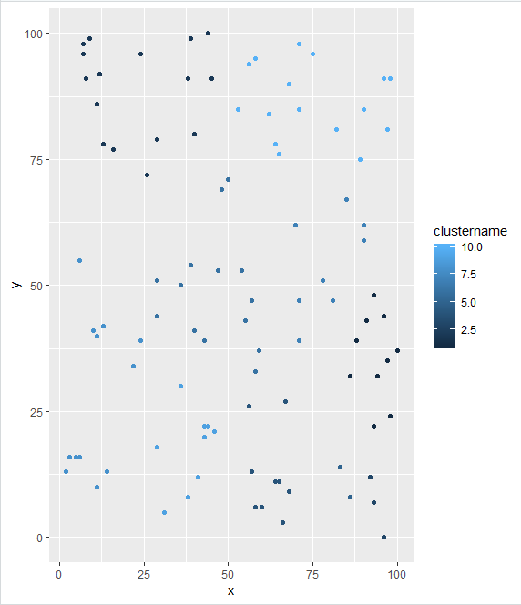

