<h1><center>作业六</center></h1>
### 一、 下载并安装HBase，尝试单机本地模式、伪分布式模式运行、集群模式（可选）。 

##### 1.安装单机本地模式的HBase

运行截图：

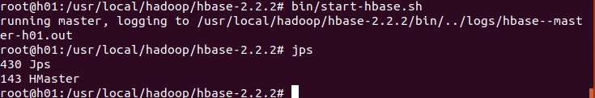

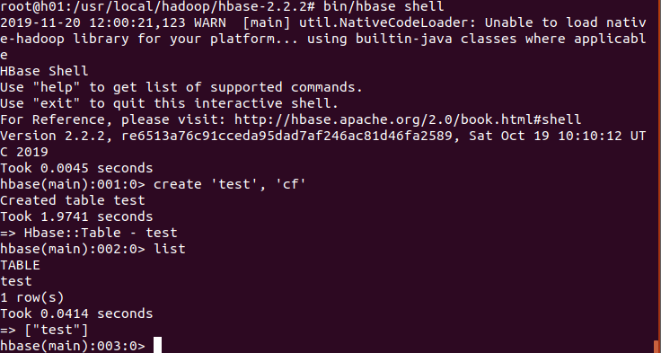

##### 2.安装伪分布式的HBase

运行截图：

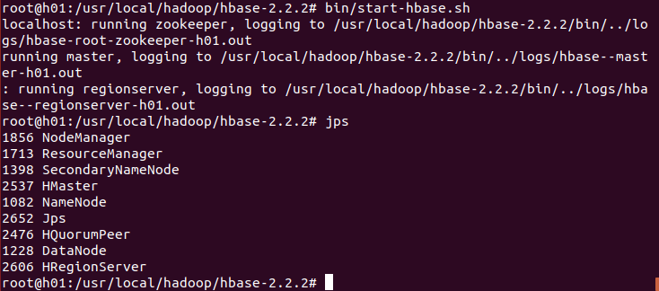

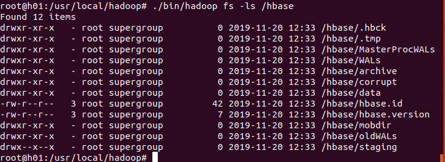

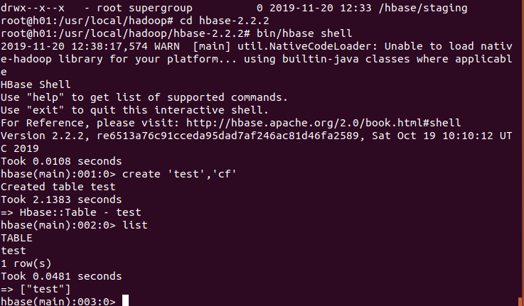

### 二、 熟悉基本的HBase Shell操作 

##### 1.创建表：

```
create 'hbase_test','column_family_1', 'column_family_2', 'column_family_3'
```

##### 2.查看表结构：

```
describe 'hbase_test'
```

##### 3.插入数据：

```
put 'hbase_test','key_1','column_family_1:column_1','value1'
put 'hbase_test','key_1','column_family_1:column_2','value2'
put 'hbase_test','key_2','column_family_1:column_1','value4'
put 'hbase_test','key_2','column_family_1:column_2','value5'
put 'hbase_test','key_3','column_family_1:column_2','value5'
put 'hbase_test','key_4','column_family_1:column_1','value1'
put 'hbase_test','key_4','column_family_2:column_3','value3'
put 'hbase_test','key_4','column_family_3:','value1'
put 'hbase_test','key_4','column_family_3:','value1'
put 'hbase_test','key_5','column_family_1:column_1','value1'
put 'hbase_test','key_5','column_family_2:column_3','value4'
put 'hbase_test','key_5','column_family_3:','value2'
```

##### 4.查询数据：

```
get 'hbase_test','key_1' 
scan 'hbase_test'
scan 'hbase_test',{COLUMN => 'column_family_1'}
count 'hbase_test'
```

##### 5.修改表结构：

```
alter 'hbase_test',NAME=>'column_family_1','column_1'=>'c_1'
```

##### 6.删除表：

```
disable 'hbase_test'
drop 'hbase_test'
```

以上操作的截图：

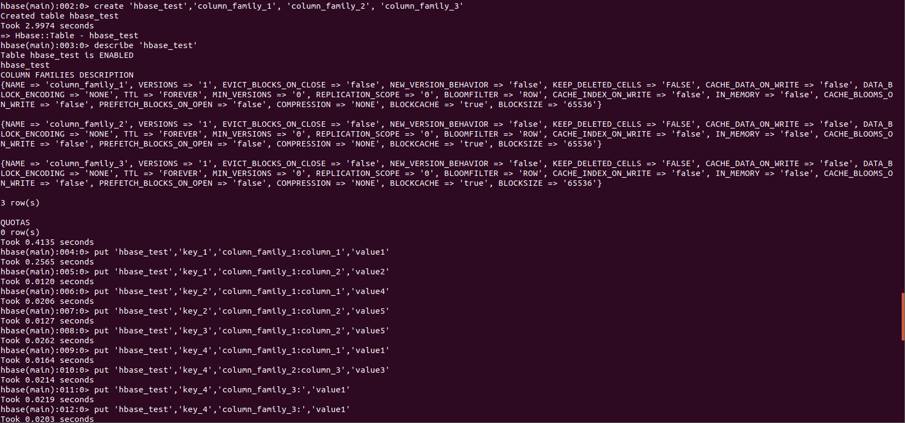

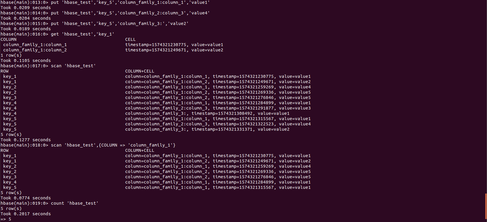

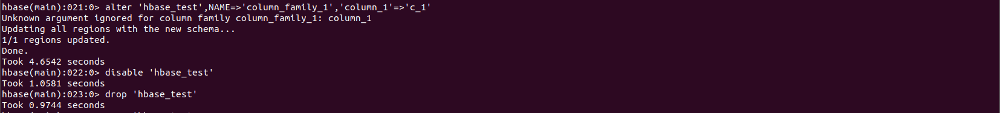

### 三、 以伪分布式运行HBase，编写Java程序，创建讲义中的students表 

程序代码：

```java
import com.google.common.io.Resources;
import org.apache.hadoop.conf.Configuration;
import org.apache.hadoop.hbase.HBaseConfiguration;
import org.apache.hadoop.hbase.HColumnDescriptor;
import org.apache.hadoop.hbase.HTableDescriptor;
import org.apache.hadoop.hbase.TableName;
import org.apache.hadoop.hbase.client.*;
import org.apache.hadoop.hbase.util.Bytes;

import java.io.IOException;

public class createStudent {
    private static Configuration configuration;
    private static Connection connection;
    private static Admin admin;
    static {
        //1.获得Configuration实例并进行相关设置
        configuration = HBaseConfiguration.create();
        configuration.set("hbase.zookeeper.property.clientPort", "2181");
        configuration.set("hbase.zookeeper.quorum", "h01");
        //2.获得Connection实例
        try {
            connection = ConnectionFactory.createConnection(configuration);
            //3.1获得Admin接口
            admin = connection.getAdmin();
        } catch (IOException e) {
            e.printStackTrace();
        }
    }
    public static void main(String[] args) throws IOException {
        //创建表
        String  familyNames[]={"ID","Description","Courses","Home"};
        createTable("student",familyNames);
        //向表中插入数据
        insert("student","001","Description","Name","Li Lei");
        insert("student","001","Description","Height","176");
        insert("student","001","Courses","Chinese","80");
        insert("student","001","Courses","Math","90");
        insert("student","001","Courses","Physics","95");
        insert("student","001","Home","Province","Zhejiang");
        insert("student","002","Description","Name","Han Meimei");
        insert("student","002","Description","Height","183");
        insert("student","002","Courses","Chinese","88");
        insert("student","002","Courses","Math","77");
        insert("student","002","Courses","Physics","66");
        insert("student","002","Home","Province","Beijing");
        insert("student","003","Description","Name","Xiao Ming");
        insert("student","003","Description","Height","162");
        insert("student","003","Courses","Chinese","90");
        insert("student","003","Courses","Math","90");
        insert("student","003","Courses","Physics","90");
        insert("student","003","Home","Province","Shanghai");
        //删除表
//        dropTable("test_hbase");
    }
    /**
     * 创建表
     * @param tableName 表名
     * @param familyNames 列族名
     * */
    public static void createTable(String tableName, String familyNames[]) throws IOException {
        //如果表存在退出
        if (admin.tableExists(TableName.valueOf(tableName))) {
            System.out.println("Table exists!");
            return;
        }
        //通过HTableDescriptor类来描述一个表，HColumnDescriptor描述一个列族
        HTableDescriptor tableDescriptor = new HTableDescriptor(TableName.valueOf(tableName));
        for (String familyName : familyNames) {
            tableDescriptor.addFamily(new HColumnDescriptor(familyName));
        }
        //tableDescriptor.addFamily(new HColumnDescriptor(familyName));
        admin.createTable(tableDescriptor);
        System.out.println("createtable success!");
    }

    /**
     * 删除表
     * @param tableName 表名
     * */
    public static void dropTable(String tableName) throws IOException {
        //如果表不存在报异常
        if (!admin.tableExists(TableName.valueOf(tableName))) {
            System.out.println(tableName+"不存在");
            return;
        }

        //删除之前要将表disable
        if (!admin.isTableDisabled(TableName.valueOf(tableName))) {
            admin.disableTable(TableName.valueOf(tableName));
        }
        admin.deleteTable(TableName.valueOf(tableName));
        System.out.println("deletetable " + tableName + "ok.");
    }

    /**
     * 指定行/列中插入数据
     * @param tableName 表名
     * @param rowKey 主键rowkey
     * @param family 列族
     * @param column 列
     * @param value 值
     * TODO: 批量PUT
     */
    public static void insert(String tableName, String rowKey, String family, String column, String value) throws IOException {
        //3.2获得Table接口,需要传入表名
        Table table =connection.getTable(TableName.valueOf(tableName));
        Put put = new Put(Bytes.toBytes(rowKey));
        put.addColumn(Bytes.toBytes(family), Bytes.toBytes(column), Bytes.toBytes(value));
        table.put(put);
        System.out.println("insertrecored " + rowKey + " totable " + tableName + "ok.");
    }

    /**
     * 删除表中的指定行
     * @param tableName 表名
     * @param rowKey rowkey
     * TODO: 批量删除
     */
    public static void delete(String tableName, String rowKey) throws IOException {
        //3.2获得Table接口,需要传入表名
        Table table = connection.getTable(TableName.valueOf(tableName));
        Delete delete = new Delete(Bytes.toBytes(rowKey));
        table.delete(delete);
    }
}
```

运行java程序成功截图：

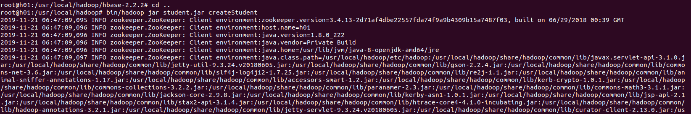

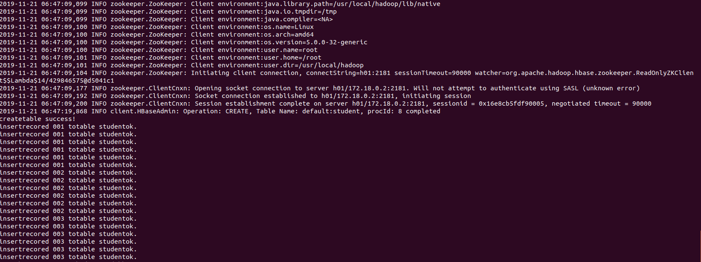

在hbase shell中查看运行结果截图：

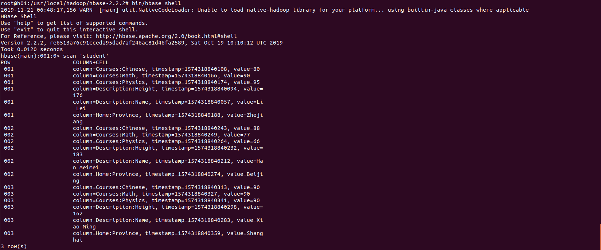