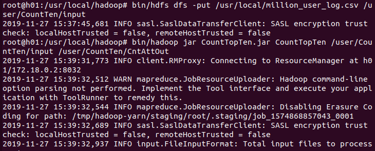
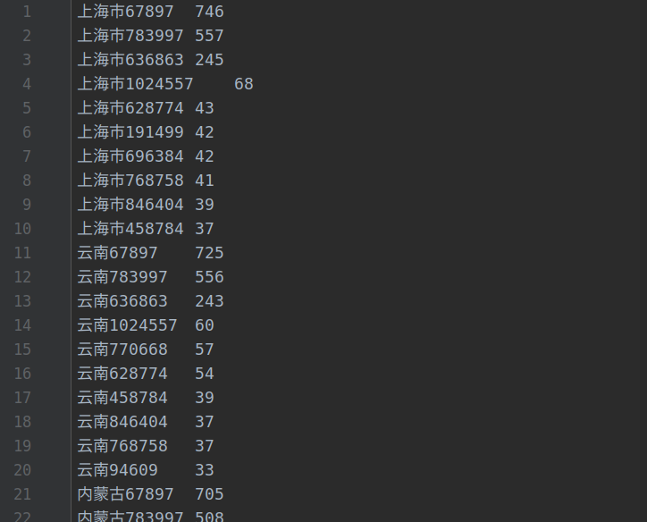
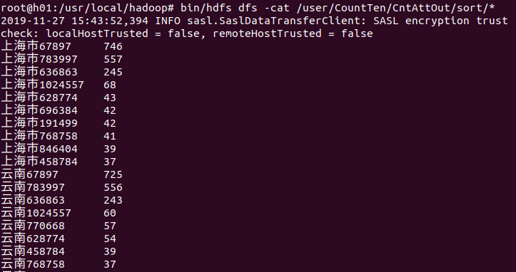
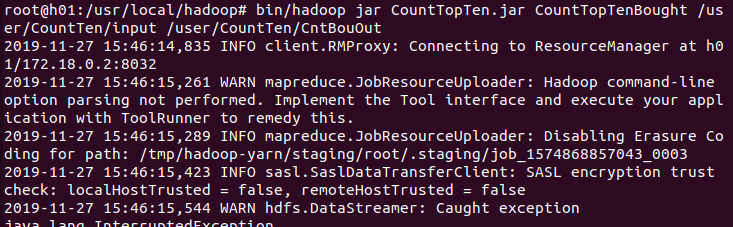
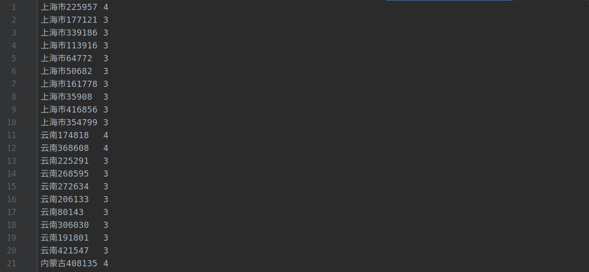
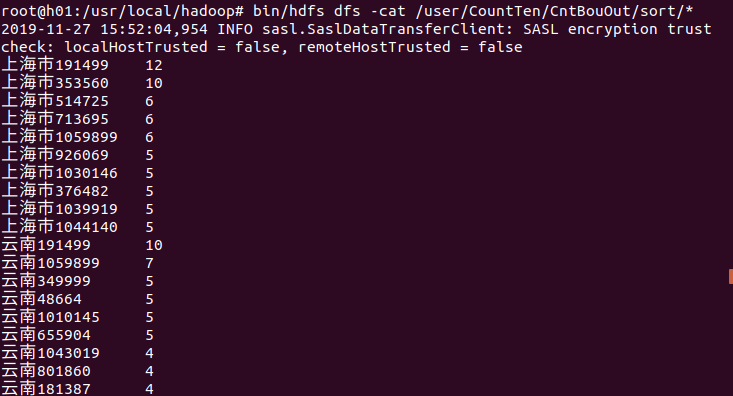

<h1>
阶段一（mapreduce）
</h1>
说明：代码在Src文件夹中，结果保存在BoughtOutput和Countoutput文件夹中

### 第一阶段（mapreduce）：

##### 一、统计各省的双十一前十热门关注产品

（“点击+添加购物车+购买+关注”总量最多前10的产品）

运行成功截图：

###### 部分结果截图:

单机运行结果：

集群结果：

##### 二、统计各省的双十一前十热门销售产品

（购买最多前10的产品）

运行截图：

###### 部分结果截图：

单机结果：

集群结果：

