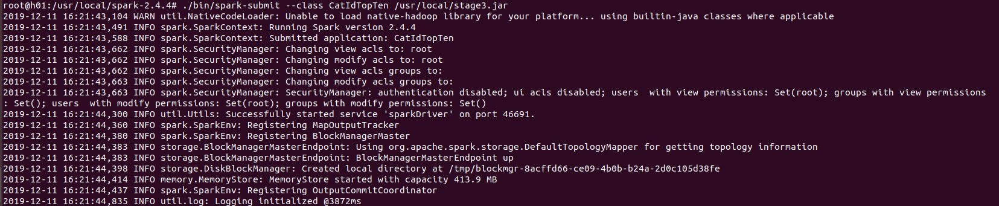
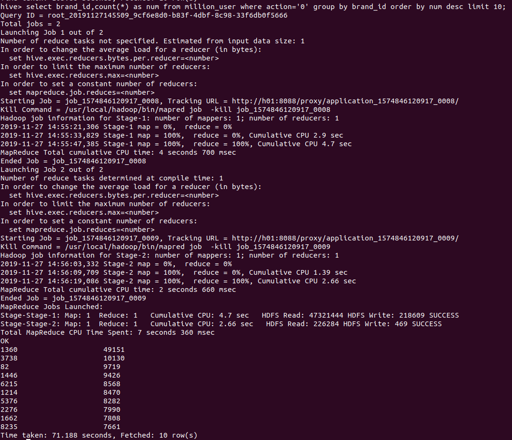

<h1>
阶段三（Spark编程）
</h1>
说明：代码在SparkScala文件夹中

### 基于精简数据集完成Spark作业：

##### 一、统计各省销售最好的产品类别前十（销售最多前10的产品类别）

scala单机运行结果截图（部分）：

spark集群运行结果：

##### 二、统计各省的双十一前十热门销售产品（购买最多前10的产品）-- 和MapReduce作业对比结果

scala单机运行结果截图（部分）：

spark集群运行截图：

hadoop的MapReduce结果截图：

对比结果，两者的结果无不同。

##### 三、查询双11那天浏览次数前十的品牌 -- 和Hive作业对比结果

单机运行截图：

scala单机运行结果截图：

左侧一列为brand_id，右侧为点击次数

spark集群运行结果：

阶段二Hive的运行结果：

对比结果相同

