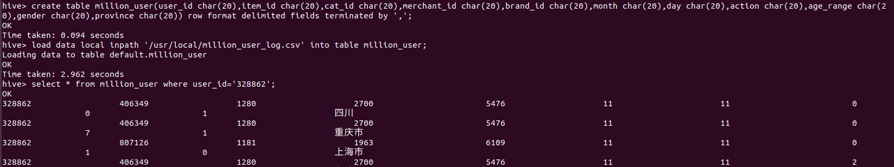
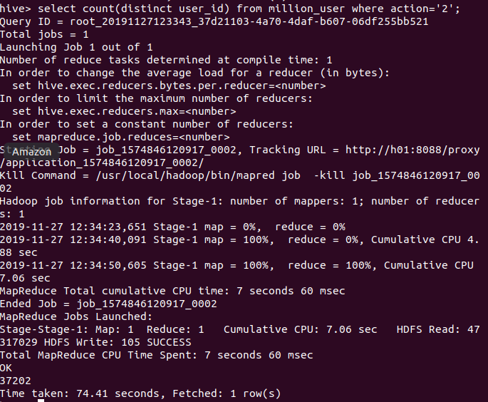
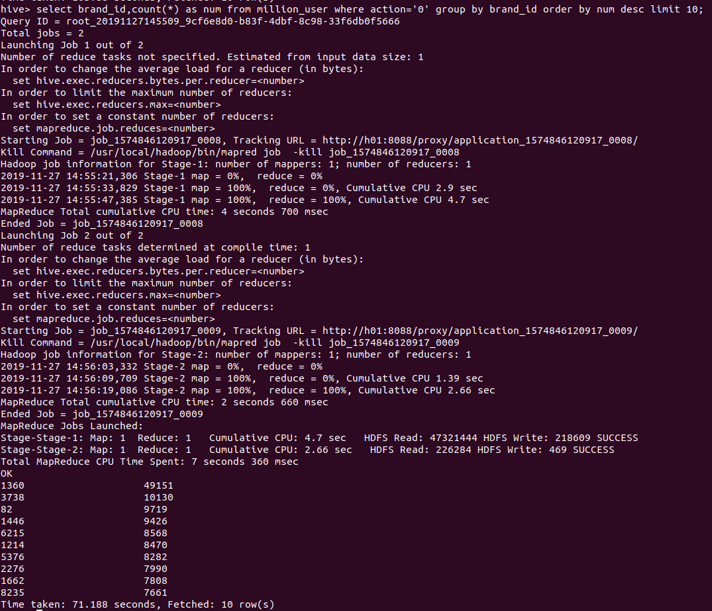

<h1>
阶段二（Hive）
</h1>

## Hive操作

### 1.把精简数据集导入到数据仓库Hive中，并对数据仓库Hive中的数据进行查询分析

导入成功截图：

### 2.查询双11那天有多少人购买了商品

结果：

即双十一那天总共有37202个用户买了商品

### 3.查询双11那天男女买家购买商品的比例

结果截图：

男性购买商品数：38932 女性购买商品数：39058

男性购买商品比例：0.49919220412873445

女性购买商品比例：0.50080779587126555

### 4.查询双11那天浏览次数前十的品牌

结果截图：

前十结果如上图

