<h1>
阶段四（datamining）
</h1>
### 1、针对预处理后的训练集和测试集，基于MapReduce或Spark MLlib编写程序预测回头客

#### （1）基于Spark ML的预测（pyspark.ml）

​			**使用pyspark.ml库中的分类包**

##### LogistRegression：

模型预测结果（部分）：

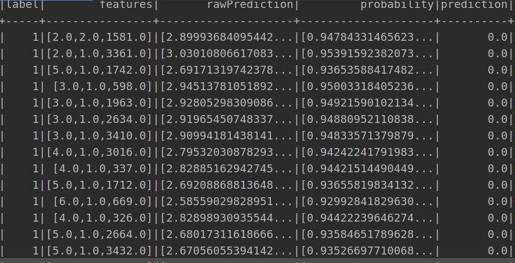

模型评估参数值：

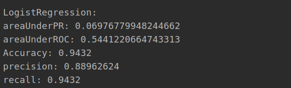

##### DecisionTree:

模型预测结果（部分）：

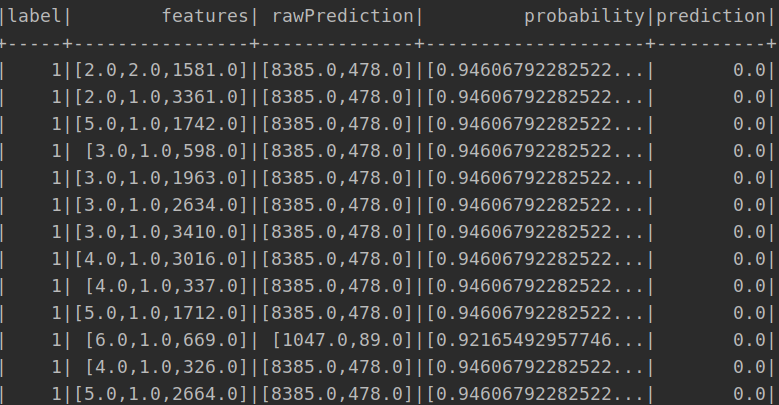

模型评估参数值：

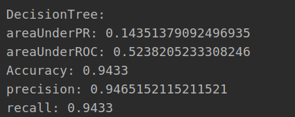

##### GBTClassifier:

模型预测结果（部分）：

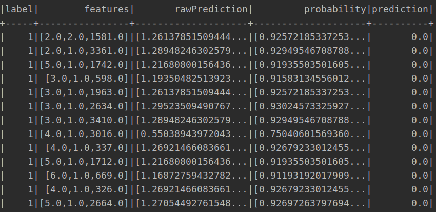

模型评估参数值：

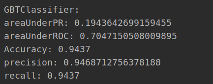

##### RandomForestClassifier:

模型预测结果（部分）：

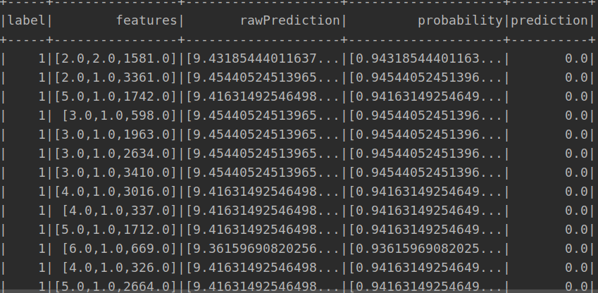

模型评估参数值：

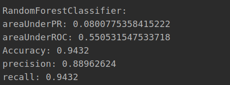

##### NaiveBayes:

模型预测结果（部分）：

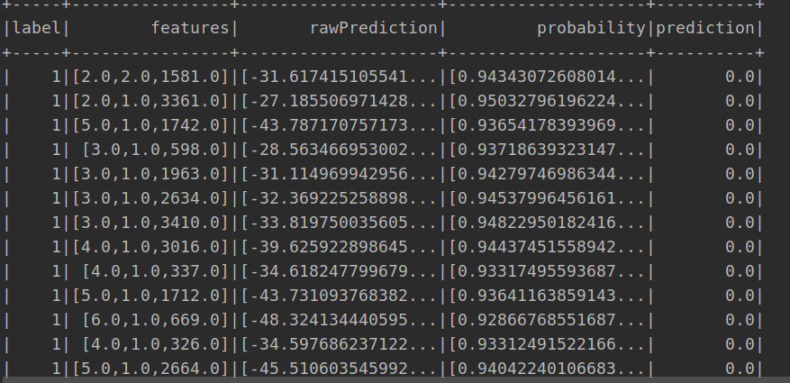

模型评估参数值：

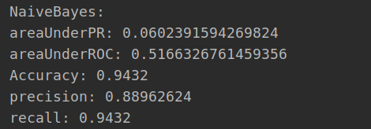

##### LinearSVC:

模型预测结果（部分）：

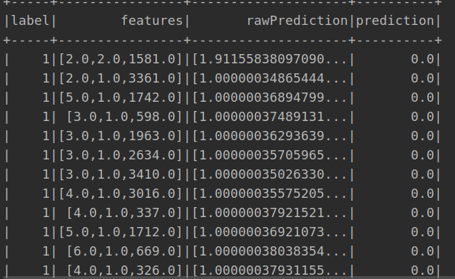

模型评估参数值：

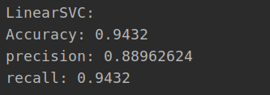

##### 模型比较：

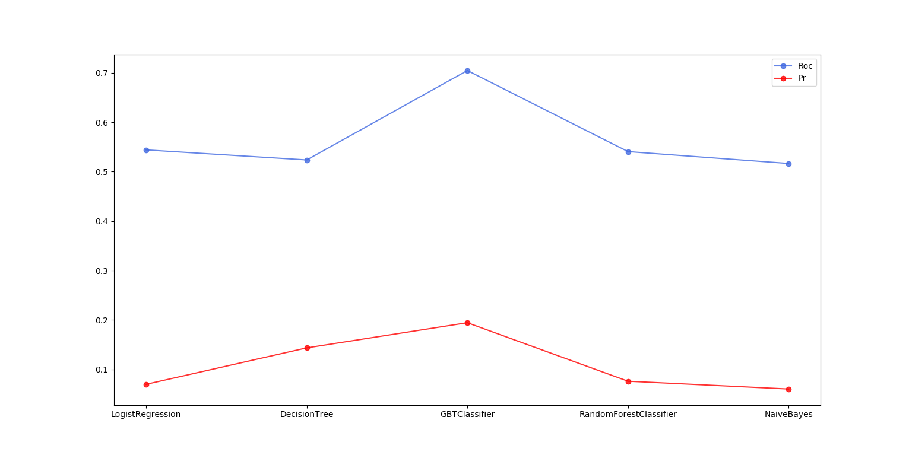

根据各个模型的Roc和Pr画出折线图可以看出

GBT和DecisionTree这两个模型的拟合效果比较好。

#### （2）基于Spark MLlib的预测（pyspark.mllib）

**说明：**以下模型中由于label为0是False，所以Precision/Recall of false是预测模型的指数

##### DecisionTree：

预测评估参数以及部分预测结果：

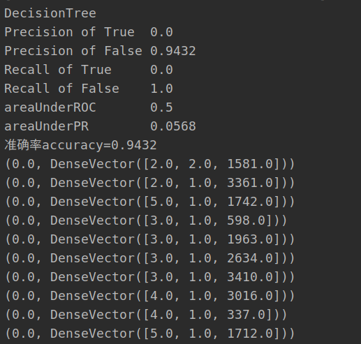

##### GradientBoostedTrees：

部分预测结果和预测模型参数评估：

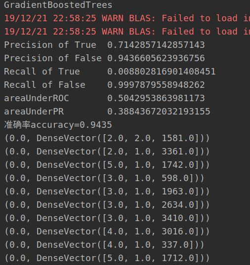

##### RandomForest:

部分预测结果和预测模型参数评估：

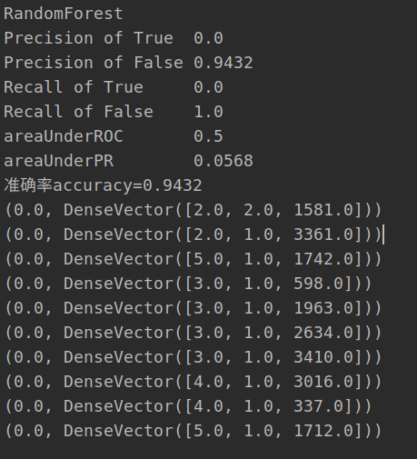

